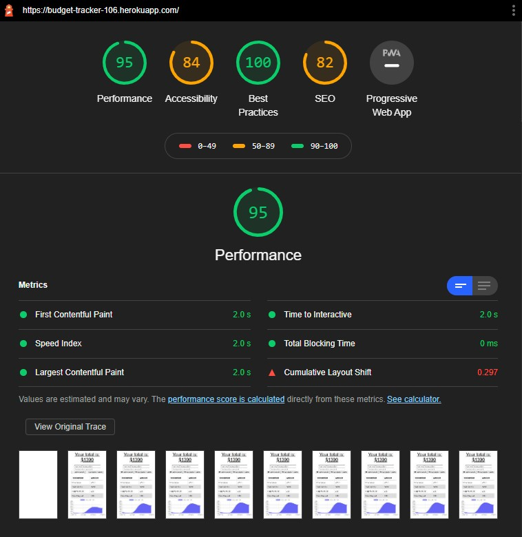
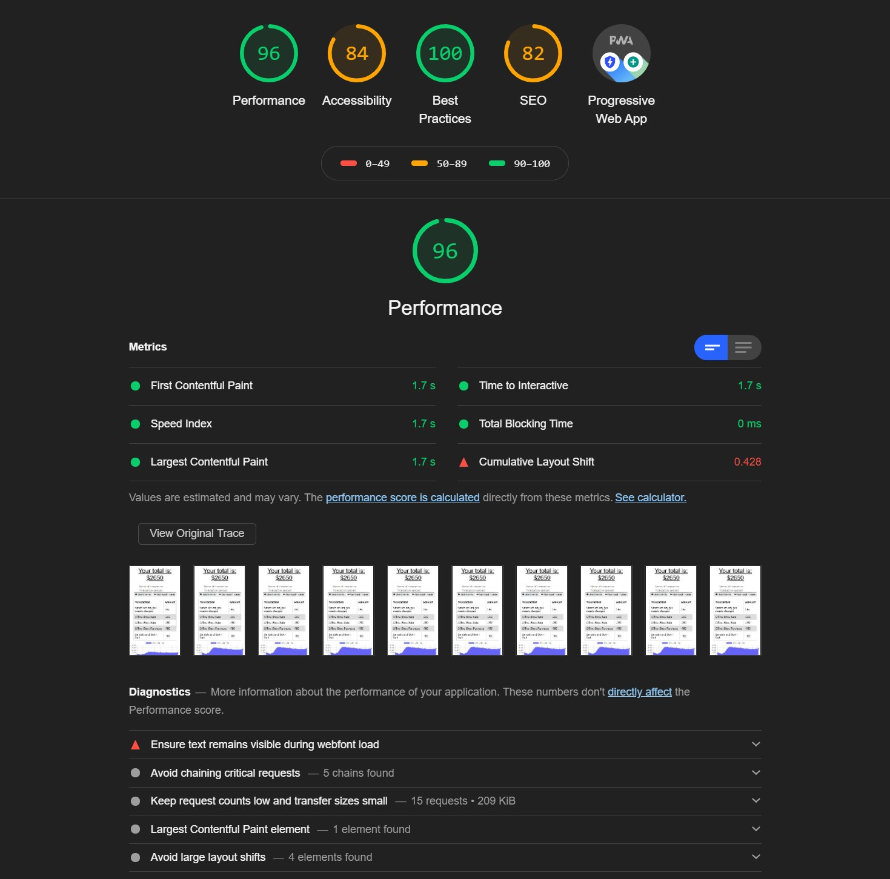
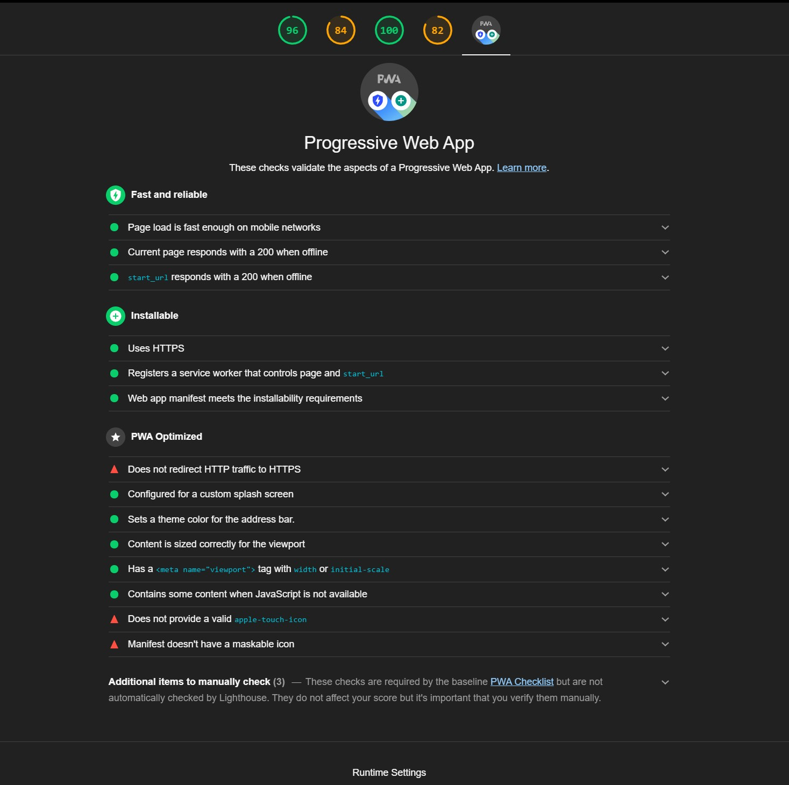

# Budget Tracker

## Description:

Giving users a fast and easy way to track their money is important, but allowing them to access that information at any time is even more important. Having offline functionality is paramount to the success of an application that handles users’ financial information. With that in mind, enter Budget Tracker. A Progressive Web Application that uses a noSQL database and offline persistance to deliver the ultimate end user experience for budgeting on the go. 

# Table of Contents 

- [Repository](#repository)
- [Walkthrough Video](#walkthrough%20video)
- [Screenshots](#screenshots)
- [User Story](#user%20story)
- [Acceptance Criteria](#Acceptance%20criteria)
- [Contributions](#contributing)
- [Tests](#tests)
- [License](#license)
- [Questions](#questions)
- [Technologies Used](#languages)

## Repository: 
- [My Github Profile](https://github.com/suschuk24)

- [This Repository](https://github.com/suschuk24/budget-tracker)

## Screenshots
### Initial Lighthouse Score before refactor

### Final Ligthouse metrics after refactor

### Final Ligthouse PWA Score

## User Story: 

* AS AN avid traveler
* I WANT to be able to track my withdrawals and deposits with or without a data/internet connection
* SO THAT my account balance is accurate when I am traveling 

## Acceptance Criteria: 

* GIVEN a budget tracker without an internet connection
* WHEN the user inputs an expense or deposit
* THEN they will receive a notification that they have added an expense or deposit
* WHEN the user reestablishes an internet connection
* THEN the deposits or expenses added while they were offline are added to their transaction history and their totals are updatedt

## License:
For more information about licenses, please visit:
[License](https://opensource.org/licenses/MIT)

## Contributing:

Seth Uschuk

## Tests:

Testing completed using InsomniaCore, Optimized using Chrome DevTools and Lighthouse, Checked for typos and bugs

## Technologies Used:

* JavaScript
* Node
* Express
* Mongoose

## Questions:

If you have any questions, please see my GitHub Page, or feel free to reach out by email:

-[GitHub's Guide to a Professional README](https://github.com/coding-boot-camp/potential-enigma/blob/master/readme-guide.md)

- [My Github Profile](https://github.com/suschuk24)

- [This Repository](https://github.com/suschuk24/budget-tracker)

- [My Email](test@gmail.com)
